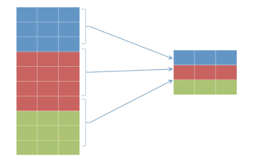
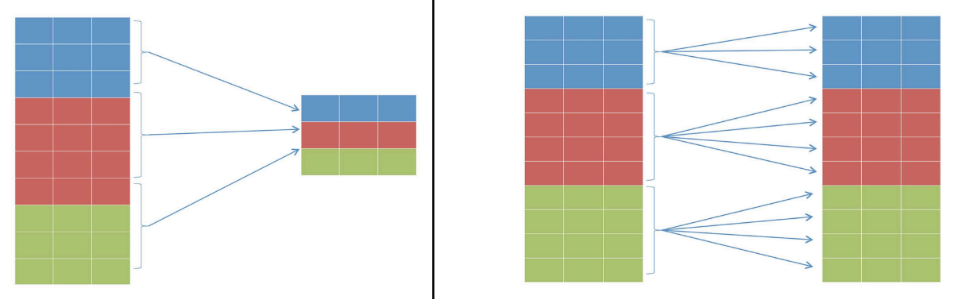

# Structured Query Language (SQL)

## Table Of Content

  - [1. Thao tác với database](#1-thao-tác-với-database)
  - [2. Thao tác với Schema](#2-thao-tác-với-schema)
  - [3. Thao tác với bảng](#3-thao-tác-với-bảng)
    - [Tạo bảng (Create)](#tạo-bảng-create)
    - [Xoá bảng (Delete)](#xoá-bảng-delete)
    - [Thay đổi bảng (Alter)](#thay-đổi-bảng-alter)
    - [Kiểu dữ liệu](#kiểu-dữ-liệu)
  - [4. Truy vấn bảng](#4-truy-vấn-bảng)
    - [4.1. Các lệnh truy vấn](#41-các-lệnh-truy-vấn)
      - [4.1.1. Các phép JOIN trong SQL](#411-các-phép-join-trong-sql)
      - [4.1.2. Condition (Điều kiện)](#412-condition-điều-kiện)
      - [4.1.3. Aggregation (Hàm tổng hợp)](#413-aggregation-hàm-tổng-hợp)
      - [4.1.4. Subquery (Truy vấn con)](#414-subquery-truy-vấn-con)
      - [4.1.5. Toán tử tập hợp](#415-toán-tử-tập-hợp)
    - [4.2. Window Functions](#42-window-functions)
      - [4.2.1 Window](#421-window)
      - [4.2.2. Window function](#422-window-function)
    - [4.3. Common Table Expression (CTE)](#43-common-table-expression-cte)
      - [4.3.1. CTE](#431-cte)
      - [4.3.2. Recursive CTE (CTE đệ quy)](#432-recursive-cte-cte-đệ-quy)
    - [4.4. Một số hàm khác](#44-một-số-hàm-khác)


## 1. Thao tác với database

Ta có tạo (Create)

```sql
CREATE DATABASE name;
```

và xoá (Delete).

```sql
DROP DATABASE name;
```

Khi xoá cần ngắt kết nối đến database cần xoá.

## 2. Thao tác với Schema

Schema là tập hợp các đối tượng (objects) trong một cơ sở dữ liệu — gồm:

- Bảng (tables)

- Khung nhìn (views)

- Hàm (functions)

- Thủ tục (stored procedures)

- Chỉ mục (indexes), v.v.

| DBMS                | Có hỗ trợ schema?           | Ghi chú                        |
| ------------------- | --------------------------- | ------------------------------ |
| **MySQL / MariaDB** | ✅ Nhưng gọi là **database** | Mỗi *database* = 1 *schema*    |
| **SQL Server**      | ✅ Có schema thật            | Mặc định là `dbo`              |
| **PostgreSQL**      | ✅ Có schema thật            | Mặc định là `public`           |
| **Oracle**          | ✅ Có schema thật            | Mỗi user = 1 schema            |
| **SQLite**          | ⚠️ Không hỗ trợ schema thật | Toàn bộ nằm trong 1 file `.db` |

Tạo Schema

```sql
CREATE SCHEMA schema_name;
```

Xoá Schema

```sql
DROP SCHEMA schema_name; -- thường chỉ được khi schema trống

-- PostgreSQL thêm CASCADE để xoá luôn các bảng
DROP SCHEMA schema_name CASCADE
```

## 3. Thao tác với bảng

### Tạo bảng (Create)

```sql
CREATE TABLE table_name (
    ...
 );
```

### Xoá bảng (Delete)

```sql
DROP TABLE table_name;
```

### Thay đổi bảng (Alter)

Nhập dữ liệu:

```sql
INSERT INTO table_name (column_names) VALUES (column_values);
```

Xoá dữ liệu:

```sql
-- Xoá theo điều kiện
DELETE FROM table_name WHERE condition;

-- Xoá toàn bộ dữ liệu của bảng
TRUNCATE TABLE table_name;
```

Cập nhật dữ liệu:

```sql
UPDATE table_name
SET column1 = value1,
    column2 = value2,
    ...
WHERE condition;
```

### Kiểu dữ liệu

Mỗi DBMS có các kiểu dữ liệu riêng, nhưng nhìn chung thì chúng được chia thành các nhóm chính: **Số học, chuỗi, ngày giờ, logic, và các kiểu đặc biệt.**

| Loại dữ liệu     | MySQL          | SQL Server    | PostgreSQL | Oracle     | SQLite         |
| ---------------- | -------------- | ------------- | ---------- | ---------- | -------------- |
| Số nguyên        | INT            | INT           | INTEGER    | NUMBER     | INTEGER        |
| Số thực | DECIMAL        | DECIMAL       | NUMERIC    | NUMBER     | REAL           |
| Chuỗi ngắn       | VARCHAR        | (N)VARCHAR      | VARCHAR    | VARCHAR2   | TEXT           |
| Chuỗi dài        | TEXT           | NVARCHAR(MAX) | TEXT       | CLOB       | TEXT           |
| Ngày giờ         | DATETIME       | DATETIME      | TIMESTAMP  | DATE       | TEXT / NUMERIC |
| Logic            | BOOLEAN        | BIT           | BOOLEAN    | (không có) | (không có)     |
| JSON             | JSON           | NVARCHAR      | JSONB      | JSON       | TEXT           |
| Tự tăng          | AUTO_INCREMENT | IDENTITY      | SERIAL     | IDENTITY   | AUTOINCREMENT  |

## 4. Truy vấn bảng

### 4.1. Các lệnh truy vấn


*Source: trên ảnh*

Ta thường viết lệnh theo thứ tự:

```FROM -> JOIN -> ON -> WHERE -> GROUP BY -> HAVING -> SELECT -> ORDER BY -> LIMIT/TOP/OFFSET```

WHERE sẽ lọc trước khi nhóm, còn HAVING sẽ lọc sau khi nhóm

#### 4.1.1. Các phép JOIN trong SQL

Các phép JOIN thường dùng


*Source: https://www.postgresqltutorial.com/*

Ngoài ra còn có NATURAL JOIN (join dựa trên các cột có cùng tên và kiểu dữ liệu), CROSS JOIN (Tích Descartes)


#### 4.1.2. Condition (Điều kiện)

- Toán tử so sánh cơ bản: ```= <> != > < >= <=```

- Trong danh sách: ```(NOT) IN (...)```

- Tồn tại: ```(NOT) EXISTS (...)```

- Null Check: ```IS (NOT) NULL```

- Trong khoảng: ```(NOT) BETWEEN ... AND ...```

- So khớp chuỗi: ```(NOT) LIKE '%Anh_'``` (%: nhiều ký tự bất kỳ, _: một ký tự bất kỳ)

- Toán tử logic: ```AND OR NOT```

#### 4.1.3. Aggregation (Hàm tổng hợp)

- Thường được sử dụng ở `SELECT` sau khi `GROUP BY`



- Một số hàm tổng hợp: `COUNT()`, `MIN()`, `MAX()`, `SUM()`, `AVG()`

#### 4.1.4. Subquery (Truy vấn con)

- Được thực thi trước truy vấn cha, đặt trong dấu `(...)`

- Có thể dùng ở nhiều chỗ nhưng thường dùng ở `WHERE`

- Thường sử dụng trong toán tử ```(NOT) IN/EXISTS (...)```

- Correlated Subquery (Truy vấn con tương quan): nghĩa là mỗi lần xét 1 dòng ở truy vấn ngoài thì SQL sẽ chạy lại truy vấn con để kiểm tra điều kiện tương ứng. Hay nói cách khác là truy vấn con phụ thuộc vào truy vấn cha. Ví dụ:

```sql
-- Hiển thị tất cả các post có lượt likes lớn hơn lượt like trung bình
SELECT * FROM posts 
WHERE likes > ( SELECT AVG(likes) FROM posts);
```

#### 4.1.5. Toán tử tập hợp

Được thực hiện khi số cột, trật tự các cột trong mỗi câu lệnh SELECT phải giống nhau.

Kiểu dữ liệu giống nhau.

- Phép hợp `UNION`: kết hợp 2 hoặc nhiều lệnh SELECT và bỏ các giá trị trùng nhau.

- Phép hợp `UNION ALL`: tương tự `UNION` nhưng không bỏ các giá trị trùng nhau.

- Phép trừ `EXCEPT`: bỏ các dòng ở lệnh SELECT sau.

- Phép giao `INTERSET`: trả về kết quả chung.

Ví dụ:

```sql
SELECT title AS datalist FROM categories 
INTERSECT
SELECT tag AS datalist FROM tags;
```

### 4.2. Window Functions

Là các hàm thực hiện phép tính trên một cửa sổ của các dòng dữ liệu có liên quan đến dòng hiện tại

Khác với `GROUP BY`, hàm cửa sổ không gom nhóm dữ liệu — mỗi dòng vẫn được giữ lại, chỉ thêm một cột kết quả tính toán



Cú pháp

```sql
<window_function>() OVER <window>
```

#### 4.2.1 Window

```sql
WINDOW w AS (
    PARTITION BY column
    ORDER BY column
    ROWS or RANGE ... -- nâng cao
)
```

- `PARTITION BY`: chia dữ liệu thành các nhóm (giống `GROUP BY`)

- `ORDER BY`: Xác định thứ tự xử lý trong từng nhóm

#### 4.2.2. Window function

Hàm tổng hợp: `MIN()`, `MAX()`, `AVG()`, `COUNT()`, `SUM()`

Hàm phân hạng:

- `ROW_NUMBER()`: đánh số thứ tự liên tiếp cho từng dòng (1, 2, 3, 4)

- `RANK()`: xếp hạng nhưng nhảy bậc khi trùng giá trị (1, 2, 2, 4)

- `DENSE_RANK()`: xếp hạng nhưng không nhảy bậc khi trùng giá trị (1, 2, 2, 3)

Hàm giá trị:

- `LAG()`: lấy giá trị dòng trước đó

- `LEAD()`: lấy giá trị dòng sau đó

- `FIRST_VALUE()`: lấy giá trị đầu tiên của cửa sổ

- `LAST_VALUE()`, `NTH_VALUE()`

Hàm thống kê / tỷ lệ:

- `NTITLE(n)`: chia dữ liệu thành n nhóm xấp xỉ bằng nhau

- `PERCENT_RANK()`: trả về thứ hạng phần trăm của dòng trong cửa sổ (%)

- `CUME_DIST()`: tính phân phối tích luỹ (%) có bao nhiêu % <=

- v.v.

```FROM -> JOIN -> ON -> WHERE -> GROUP BY -> HAVING -> WINDOW FUNCTIONS -> SELECT -> ORDER BY -> LIMIT/TOP/OFFSET```

### 4.3. Common Table Expression (CTE)

#### 4.3.1. CTE

Là một bảng tạm đặt tên, chỉ tồn tại trong phạm vi truy vấn đó.

Giúp truy vấn SQL dễ đọc, dễ bảo trì hơn.

```sql
WITH cte_name AS(
    CTE_query_definition
)
statement;
```

Dùng nhiều CTE:

```sql
WITH 
cte_1 AS(
    CTE_query_definition
),
cte_2 AS(
    CTE_query_definition
)
statement;
```

#### 4.3.2. Recursive CTE (CTE đệ quy)

Làm việc với cấu trúc phân cấp (tree)

Ví dụ:

Bảng nhân viên

| MaNV | TenNV | MaQL |
| ---- | ----- | ---- |
| 1    | An    | NULL |
| 2    | Binh  | 1    |
| 3    | Chi   | 2    |
| 4    | Dung  | 2    |

CTE đệ quy:

```sql
WITH RECURSIVE CapQuanLy AS (
    -- Bước 1: chọn gốc
    SELECT MaNV, TenNV, MaQL
    FROM NhanVien
    WHERE TenNV = 'Dung'

    UNION ALL

    -- Bước 2: nối dần lên cấp trên
    SELECT nv.MaNV, nv.TenNV, nv.MaQL
    FROM NhanVien nv
    JOIN CapQuanLy cq ON nv.MaNV = cq.MaQL
)
SELECT * FROM CapQuanLy;
```

Kết quả:

| MaNV | TenNV | MaQL |
| ---- | ----- | ---- |
| 4    | Dung  | 2    |
| 2    | Binh  | 1    |
| 1    | An    | NULL |

Ta đã truy ngược từ Dung → Binh → An

### 4.4. Một số hàm khác

CASE ... WHEN: cấu trúc rẽ nhánh trong SQL

```sql
CASE
    WHEN condition_1 THEN result_1
    WHEN condition_2 THEN result_2
    ...
    ELSE default_result
END
```

COALESCE(): trả về đối số non-null đầu tiên

```sql
SELECT COALESCE(NULL, 2, 1) -- 2
```

CAST(): chuyển đổi kiểu dữ liệu

```sql
CAST('100' AS INTEGER)
```

TO BE CONTINUE ...

### 4.5. Tối ưu hoá truy vấn (SQL Query Optimization)

Một số kỹ thuật tối ưu hoá truy vấn:

**1. Sử dụng Index:**

**2. Sử dụng SELECT hợp lý:**

**3. Sử dụng LIMIT khi chỉ cần 1 phần dữ liệu:**

**4. Sử dụng phép JOIN hiệu quả:**

**5. Phân tích Query Execution Plans:**

**6. Tối ưu điều kiện WHERE:**

**7. Tối ưu Subquery:**

**8. Sử dụng EXISTS thay vì IN:**

**9. Tránh sử dụng DISTINCT:**

**10. Tận dụng các tính năng dành riêng cho CSDL:**

**11. Tránh GROUP BY / ORDER BY khi không cần thiết:**

**12. Sử dụng UNION ALL thay vì UNION:**

**13. Chia nhỏ truy vấn phức tạp:**