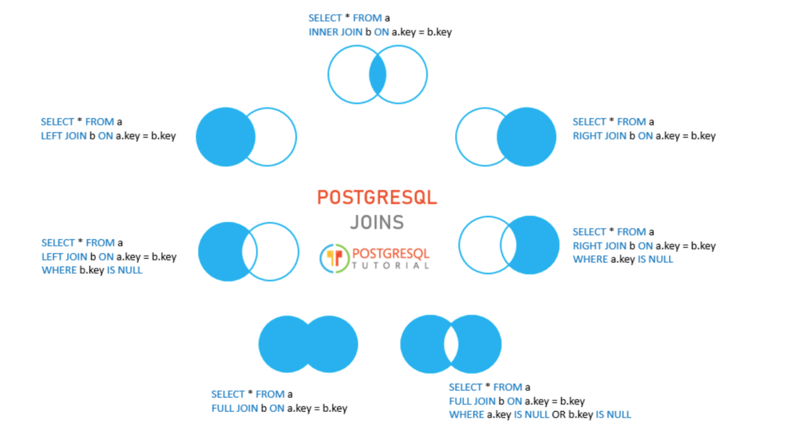

# Structured Query Language (SQL)

## 1. Thao tác với database

Ta có tạo (Create)

```sql
CREATE DATABASE name;
```

và xoá (Delete).

```sql
DROP DATABASE name;
```

Khi xoá cần ngắt kết nối đến database cần xoá.

## 2. Thao tác với Schema

Schema là tập hợp các đối tượng (objects) trong một cơ sở dữ liệu — gồm:

- Bảng (tables)

- Khung nhìn (views)

- Hàm (functions)

- Thủ tục (stored procedures)

- Chỉ mục (indexes), v.v.

| DBMS                | Có hỗ trợ schema?           | Ghi chú                        |
| ------------------- | --------------------------- | ------------------------------ |
| **MySQL / MariaDB** | ✅ Nhưng gọi là **database** | Mỗi *database* = 1 *schema*    |
| **SQL Server**      | ✅ Có schema thật            | Mặc định là `dbo`              |
| **PostgreSQL**      | ✅ Có schema thật            | Mặc định là `public`           |
| **Oracle**          | ✅ Có schema thật            | Mỗi user = 1 schema            |
| **SQLite**          | ⚠️ Không hỗ trợ schema thật | Toàn bộ nằm trong 1 file `.db` |

Tạo Schema

```sql
CREATE SCHEMA schema_name;
```

Xoá Schema

```sql
DROP SCHEMA schema_name; -- thường chỉ được khi schema trống

-- PostgreSQL thêm CASCADE để xoá luôn các bảng
DROP SCHEMA schema_name CASCADE
```

## 3. Thao tác với bảng

### Tạo bảng (Create)

```sql
CREATE TABLE table_name (
    ...
 );
```

### Xoá bảng (Delete)

```sql
DROP TABLE table_name;
```

### Thay đổi bảng (Alter)

Nhập dữ liệu:

```sql
INSERT INTO table_name (column_names) VALUES (column_values);
```

Xoá dữ liệu:

```sql
-- Xoá theo điều kiện
DELETE FROM table_name WHERE condition;

-- Xoá toàn bộ dữ liệu của bảng
TRUNCATE TABLE table_name;
```

Cập nhật dữ liệu:

```sql
UPDATE table_name
SET column1 = value1,
    column2 = value2,
    ...
WHERE condition;
```

## Kiểu dữ liệu

Mỗi DBMS có các kiểu dữ liệu riêng, nhưng nhìn chung thì chúng được chia thành các nhóm chính: **Số học, chuỗi, ngày giờ, logic, và các kiểu đặc biệt.**

| Loại dữ liệu     | MySQL          | SQL Server    | PostgreSQL | Oracle     | SQLite         |
| ---------------- | -------------- | ------------- | ---------- | ---------- | -------------- |
| Số nguyên        | INT            | INT           | INTEGER    | NUMBER     | INTEGER        |
| Số thực | DECIMAL        | DECIMAL       | NUMERIC    | NUMBER     | REAL           |
| Chuỗi ngắn       | VARCHAR        | (N)VARCHAR      | VARCHAR    | VARCHAR2   | TEXT           |
| Chuỗi dài        | TEXT           | NVARCHAR(MAX) | TEXT       | CLOB       | TEXT           |
| Ngày giờ         | DATETIME       | DATETIME      | TIMESTAMP  | DATE       | TEXT / NUMERIC |
| Logic            | BOOLEAN        | BIT           | BOOLEAN    | (không có) | (không có)     |
| JSON             | JSON           | NVARCHAR      | JSONB      | JSON       | TEXT           |
| Tự tăng          | AUTO_INCREMENT | IDENTITY      | SERIAL     | IDENTITY   | AUTOINCREMENT  |

## 4. Truy vấn bảng

### 4.1. Các lệnh cơ bản


*Source: trên ảnh*

Ta thường viết lệnh theo thứ tự:

```FROM -> JOIN -> ON -> WHERE -> GROUP BY -> HAVING -> SELECT -> ORDER BY -> LIMIT/TOP/OFFSET```

WHERE sẽ lọc trước khi nhóm, còn HAVING sẽ lọc sau khi nhóm

#### 4.1.1 Các phép JOIN trong SQL

Các phép JOIN thường dùng


*Source: https://www.postgresqltutorial.com/*

Ngoài ra còn có NATURAL JOIN (join dựa trên các cột có cùng tên và kiểu dữ liệu), CROSS JOIN (Tích Descartes)


#### 4.1.2 Điều kiện (WHERE/HAVING)